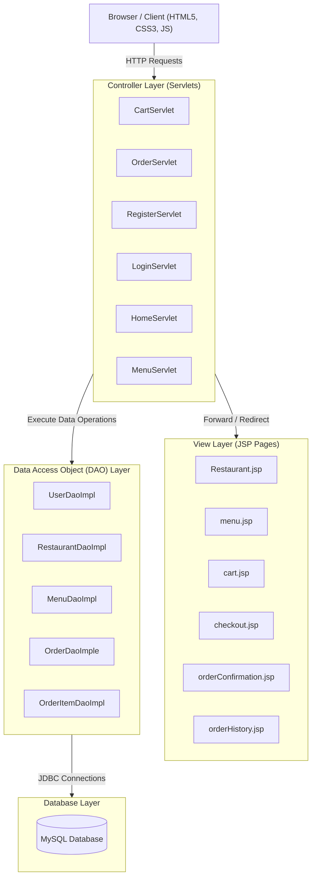
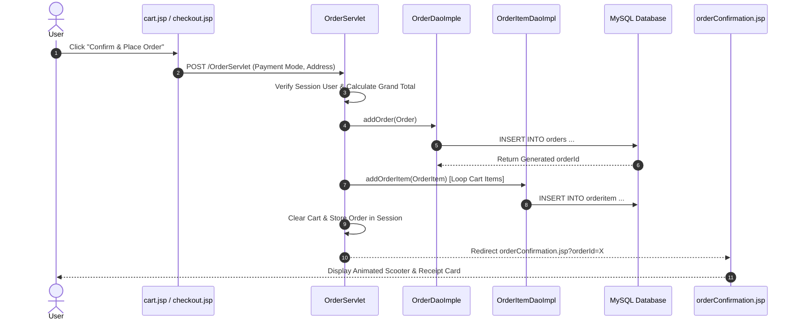
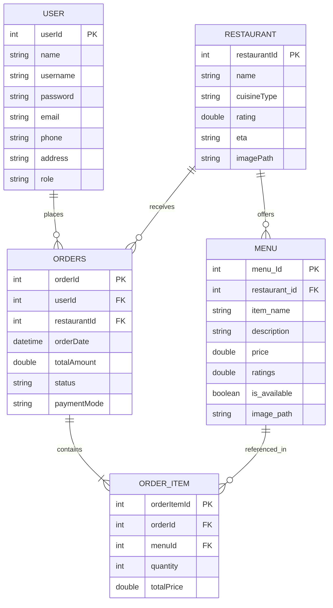

# 🍽️ Mealtime — Full-Stack Food Delivery Application

A modern, responsive, end-to-end food delivery web application built using **Java EE (Jakarta Servlets)**, **JSP**, **MySQL RDBMS**, and a custom **Vanilla Frontend Design System (HTML5 / CSS3 / ES6+ JavaScript)**.

---

## 📖 Table of Contents

- [Overview](#-overview)
- [Key Features](#-key-features)
- [System Architecture](#-system-architecture)
- [Design Patterns Implemented](#-design-patterns-implemented)
- [Technology Stack](#-technology-stack)
- [Database Schema & ER Model](#-database-schema--er-model)
- [Project Directory Structure](#-project-directory-structure)
- [Installation & Setup Guide](#-installation--setup-guide)
- [Screen Highlights](#-screen-highlights)

---

## 🌟 Overview

**Mealtime** allows users to discover local restaurants, explore curated multi-cuisine menus, add dishes to an active shopping cart, complete checkout using multiple payment options, and track detailed order history.

The application enforces **clean separation of concerns** by using the **MVC (Model-View-Controller)** pattern and **DAO (Data Access Object)** pattern for database interaction, guaranteeing high performance, security, and maintainability.

---

## ✨ Key Features

- **🍔 Restaurant & Menu Discovery**: Browse top-rated kitchens, view cuisine tags, ratings, ETAs, and dish availability (Veg/Non-Veg indicators).
- **🛒 Dynamic Shopping Cart**: Add, update quantities, delete items, and calculate item subtotals, packaging, taxes, and free delivery thresholds in real time.
- **💳 Multi-Payment Selection**: Support for Cash on Delivery, UPI / Google Pay, Credit/Debit Cards, and Net Banking.
- **🛵 Animated Order Confirmation**: Vector-animated food delivery driver hero illustration upon order placement.
- **📦 Comprehensive Order History**: Track past orders with itemized breakdowns, dates, statuses (`Placed`), payment modes, and totals.
- **🔐 User Authentication**: Secure sign-up, login, role management (Customer, Restaurant Owner, Delivery Partner), and HTTP session persistence.

---

## 🏗️ System Architecture

Mealtime is architected using standard 3-Tier Enterprise Web Application principles:



### Order Placement Workflow



---

## 📐 Design Patterns Implemented

### 1. Model-View-Controller (MVC)
* **Model**: Java classes (`User`, `Restaurant`, `Menu`, `Order`, `OrderItem`, `Cart`, `CartItem`) representing data and business domain rules.
* **View**: Modular JSP pages (`Restaurant.jsp`, `menu.jsp`, `cart.jsp`, `checkout.jsp`, `orderConfirmation.jsp`, `orderHistory.jsp`) rendering HTML UI.
* **Controller**: Java Servlets (`CartServlet`, `OrderServlet`, `RegisterServlet`, `LoginServlet`, etc.) handling HTTP requests and directing user flow.

### 2. Data Access Object (DAO) Pattern
* Encapsulates all SQL query execution behind clear interfaces (`UserDao`, `RestaurantDao`, `MenuDao`, `OrderDao`, `OrderItemDao`) and concrete classes (`UserDaoImple`, `RestaurantDaoImpl`, etc.), ensuring persistence logic is cleanly isolated from business logic.

### 3. Singleton / Helper Pattern (`DBConnection`)
* Centralized database utility ([DBConnection.java](file:///Users/karthikjk/eclipse-workspace/Mealtime-FoodDeliveryApp/src/main/java/com/mealtime/util/DBConnection.java)) providing unified JDBC connection creation with auto-closing resources via try-with-resources blocks.

### 4. Session State Pattern
* Manages transient user state, shopping cart contents (`Cart`), and active order context securely across multi-step HTTP requests.

---

## 🛠️ Technology Stack

| Layer | Technology |
| :--- | :--- |
| **Backend Core** | Java 17+, Jakarta Servlets API 6.0, JavaServer Pages (JSP) |
| **Database** | MySQL RDBMS (8.0+), JDBC, PreparedStatements |
| **Frontend** | HTML5, Modern CSS3 (Flexbox, CSS Grid, Glassmorphic Tokens), ES6+ JavaScript |
| **Web Server** | Apache Tomcat 10+ |
| **IDE / Tools** | Eclipse IDE for Enterprise Java and Web Developers, MySQL Workbench |

---

## 🗄️ Database Schema & ER Model



---

## 📁 Project Directory Structure

```
Mealtime-FoodDeliveryApp/
├── src/
│   └── main/
│       ├── java/
│       │   └── com/
│       │       └── mealtime/
│       │           ├── dao/                     # DAO Interfaces
│       │           │   ├── UserDao.java
│       │           │   ├── RestaurantDao.java
│       │           │   ├── MenuDao.java
│       │           │   ├── OrderDao.java
│       │           │   └── OrderItemDao.java
│       │           ├── daoimplementation/       # JDBC DAO Implementations
│       │           │   ├── UserDaoImple.java
│       │           │   ├── RestaurantDaoImpl.java
│       │           │   ├── MenuDaoImpl.java
│       │           │   ├── OrderDaoImple.java
│       │           │   └── OrderItemDaoImpl.java
│       │           ├── model/                   # Domain Models & Entities
│       │           │   ├── User.java
│       │           │   ├── Restaurant.java
│       │           │   ├── Menu.java
│       │           │   ├── Order.java
│       │           │   ├── OrderItem.java
│       │           │   ├── Cart.java
│       │           │   └── CartItem.java
│       │           ├── servlet/                 # Controller Servlets
│       │           │   ├── CartServlet.java
│       │           │   ├── OrderServlet.java
│       │           │   ├── RegisterServlet.java
│       │           │   ├── LoginServlet.java
│       │           │   ├── HomeServlet.java
│       │           │   ├── MenuServlet.java
│       │           │   └── LogoutServlet.java
│       │           └── util/                    # Database Helper Connection
│       │               └── DBConnection.java
│       └── webapp/
│           ├── css/                             # Custom Design System & Page Styles
│           │   ├── home.css
│           │   ├── menu.css
│           │   ├── cart.css
│           │   ├── checkout.css
│           │   ├── login.css
│           │   └── modern-design.css
│           ├── js/                              # Interactive JavaScript Engine
│           │   └── modern-app.js
│           ├── Restaurant.jsp                   # Homepage View
│           ├── menu.jsp                         # Restaurant Menu View
│           ├── cart.jsp                         # Shopping Cart View
│           ├── checkout.jsp                     # Checkout & Payment Selection View
│           ├── orderConfirmation.jsp            # Animated Confirmation Receipt
│           ├── orderHistory.jsp                 # User Order History View
│           ├── login.html                       # User Sign-In Form
│           └── register.html                    # User Sign-Up Form
└── README.md
```

---

## ⚡ Installation & Setup Guide

### 1. Prerequisites
- **Java Development Kit (JDK 17 or higher)**
- **Apache Tomcat 10+** (or compatible Servlet container)
- **MySQL Server 8.0+**
- **Eclipse IDE for Enterprise Java Developers**

### 2. Database Initialization
Create the database and required tables in MySQL:

```sql
CREATE DATABASE IF NOT EXISTS fooddeliveryapp;
USE fooddeliveryapp;

-- Create User Table
CREATE TABLE user (
    userId INT AUTO_INCREMENT PRIMARY KEY,
    name VARCHAR(100) NOT NULL,
    username VARCHAR(100) UNIQUE NOT NULL,
    password VARCHAR(255) NOT NULL,
    email VARCHAR(100) UNIQUE NOT NULL,
    phone VARCHAR(20) NOT NULL,
    address TEXT NOT NULL,
    role VARCHAR(50) DEFAULT 'Customer',
    createdDate TIMESTAMP DEFAULT CURRENT_TIMESTAMP,
    lastLoginDate TIMESTAMP NULL
);

-- Create Restaurant Table
CREATE TABLE restaurant (
    restaurantId INT AUTO_INCREMENT PRIMARY KEY,
    name VARCHAR(100) NOT NULL,
    cuisineType VARCHAR(100),
    rating DOUBLE DEFAULT 4.5,
    eta VARCHAR(50) DEFAULT '30-40',
    imagePath TEXT
);

-- Create Menu Table
CREATE TABLE menu (
    menu_Id INT AUTO_INCREMENT PRIMARY KEY,
    restaurant_id INT NOT NULL,
    item_name VARCHAR(100) NOT NULL,
    description TEXT,
    price DOUBLE NOT NULL,
    ratings DOUBLE DEFAULT 4.5,
    is_available TINYINT(1) DEFAULT 1,
    image_path TEXT,
    FOREIGN KEY (restaurant_id) REFERENCES restaurant(restaurantId) ON DELETE CASCADE
);

-- Create Orders Table
CREATE TABLE orders (
    orderId INT AUTO_INCREMENT PRIMARY KEY,
    userId INT NOT NULL,
    restaurantId INT NOT NULL,
    orderDate TIMESTAMP DEFAULT CURRENT_TIMESTAMP,
    totalAmount DOUBLE NOT NULL,
    status VARCHAR(50) DEFAULT 'Placed',
    paymentMode VARCHAR(50) NOT NULL,
    FOREIGN KEY (userId) REFERENCES user(userId) ON DELETE CASCADE,
    FOREIGN KEY (restaurantId) REFERENCES restaurant(restaurantId) ON DELETE CASCADE
);

-- Create OrderItem Table
CREATE TABLE orderitem (
    orderItemId INT AUTO_INCREMENT PRIMARY KEY,
    orderId INT NOT NULL,
    menuId INT NOT NULL,
    quantity INT NOT NULL,
    totalPrice DOUBLE NOT NULL,
    FOREIGN KEY (orderId) REFERENCES orders(orderId) ON DELETE CASCADE,
    FOREIGN KEY (menuId) REFERENCES menu(menu_Id) ON DELETE CASCADE
);
```

### 3. Deploy and Run
1. Clone or import the repository into **Eclipse IDE**.
2. Update database credentials in `DBConnection.java` if needed (`url`, `username`, `password`).
3. Add **Apache Tomcat 10+** server runtime in Eclipse.
4. Right-click project -> **Run As** -> **Run on Server**.
5. Access the application in browser at: `http://localhost:8080/Mealtime-FoodDeliveryApp/home`

---

## 👩‍💻 Author & Maintainer

Developed with ❤️ for food lovers.
